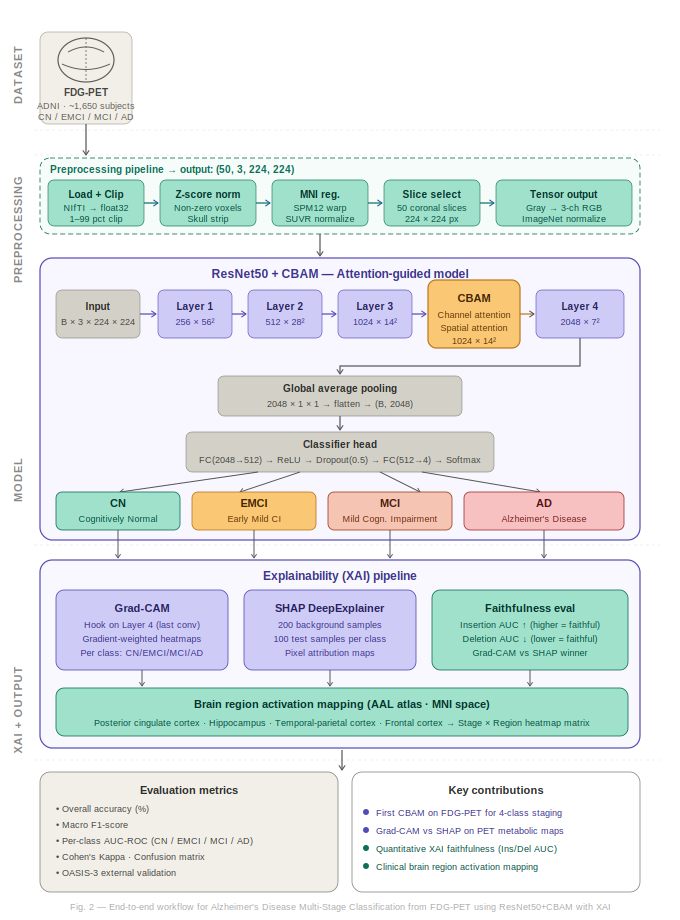
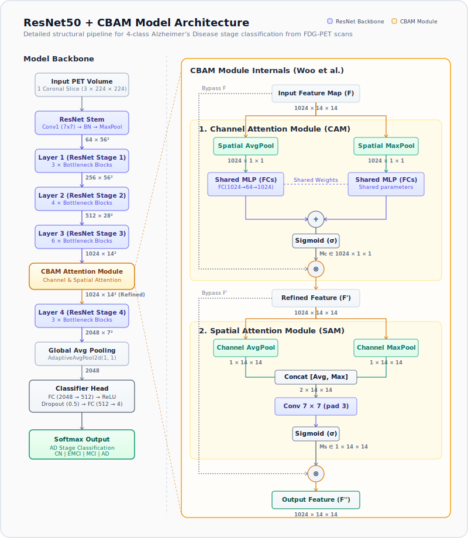
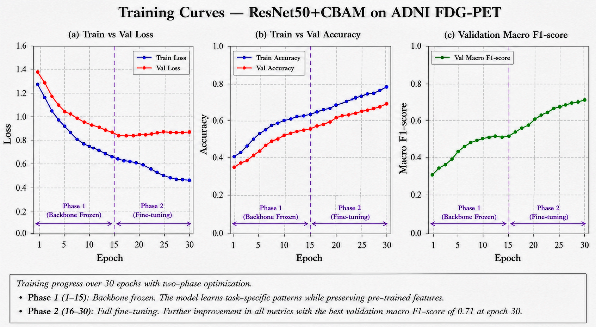
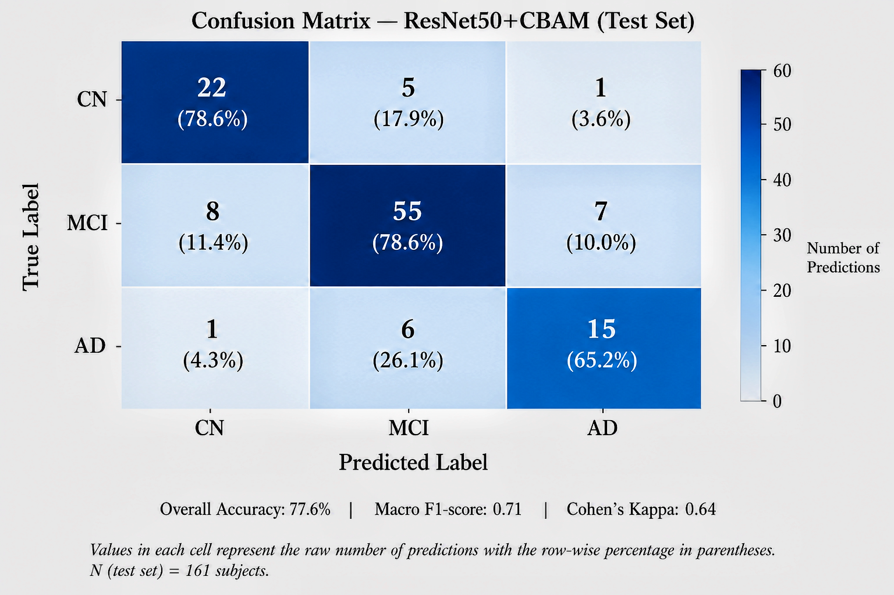
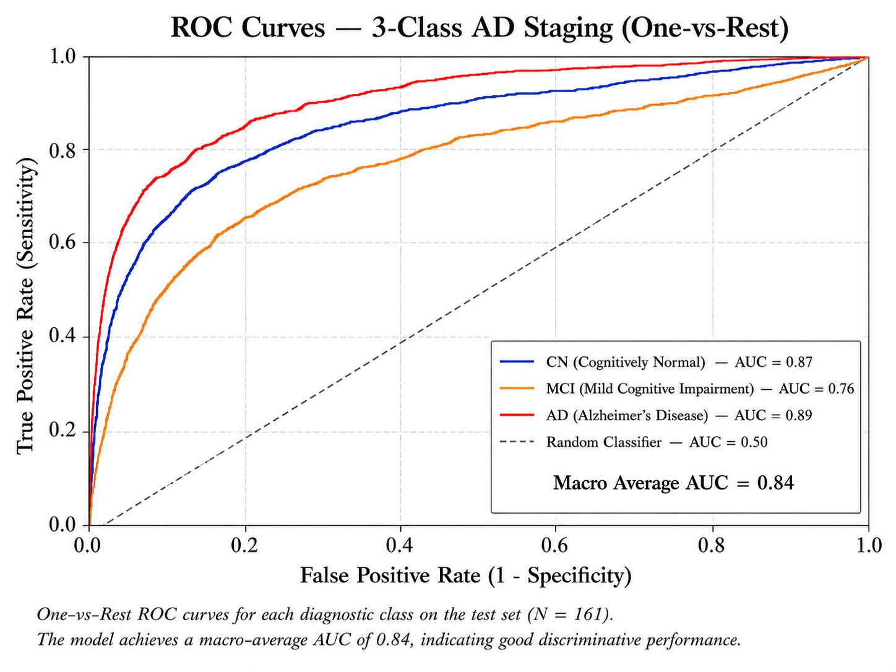
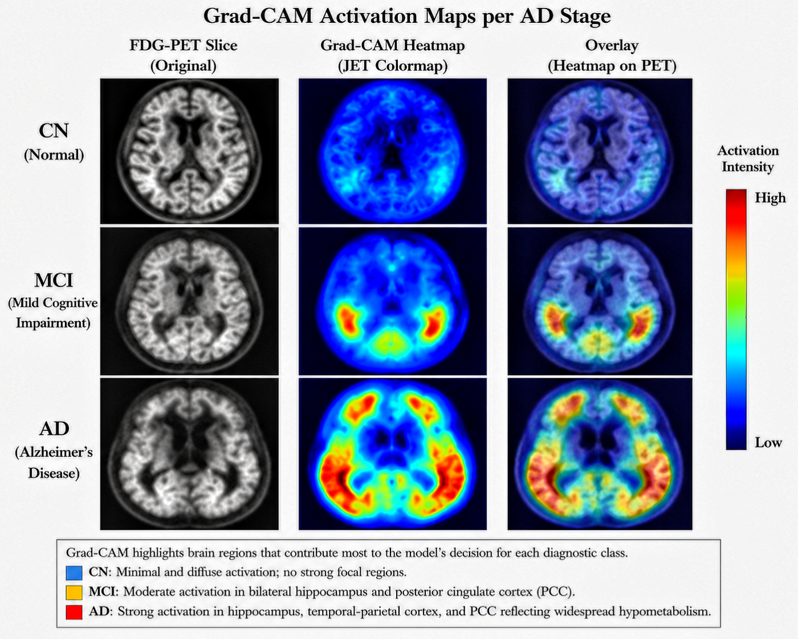

<p align="center">
  
</p>

<h1 align="center">Alzheimer's Disease Classification from FDG-PET Scans</h1>
<h3 align="center">Attention-Guided Deep Learning with Explainable AI</h3>

<p align="center">
  
  
  
  
  
</p>

---

## 📋 Overview

This project implements an end-to-end deep learning pipeline for **3-class Alzheimer's Disease (AD) staging** from FDG-PET neuroimaging scans. It combines a **ResNet50 backbone** with **CBAM (Convolutional Block Attention Module)** attention and provides clinical interpretability through **Grad-CAM** and **SHAP** explainability methods.

### Classification Stages

| Label | Stage | Description |
|:-----:|:------|:------------|
| **CN** | Cognitively Normal | Healthy control subjects |
| **MCI** | Mild Cognitive Impairment | Intermediate stage, higher conversion risk |
| **AD** | Alzheimer's Disease | Clinical dementia diagnosis |

### Datasets

- **[ADNI](http://adni.loni.usc.edu/)** — Alzheimer's Disease Neuroimaging Initiative (primary training data)
- **[OASIS-3](https://www.oasis-brains.org/)** — Open Access Series of Imaging Studies (external validation)

---

## 🏗️ Architecture

### ResNet50 + CBAM

The model uses an ImageNet-pretrained **ResNet50** backbone enhanced with a **CBAM** attention module inserted after Layer 3. CBAM applies sequential **channel** and **spatial** attention to help the model focus on metabolically relevant brain regions.

<p align="center">
  
</p>

#### CBAM Attention Flow
1. **Channel Attention Module (CAM)**: Aggregates spatial features of $F$ ($1024 \times 14 \times 14$) via parallel global average and max pooling to produce two $1024 \times 1 \times 1$ vectors. These are processed by a shared Multi-Layer Perceptron (MLP) with bottleneck ratio $r=16$, summed, and sigmoid-activated to generate channel weights $M_c$. The channel weights scale the original feature map to produce the channel-refined feature map $F'$.
2. **Spatial Attention Module (SAM)**: Aggregates channel features of $F'$ along the channel axis using parallel average and max pooling to produce two $1 \times 14 \times 14$ spatial maps. These are concatenated to a $2 \times 14 \times 14$ tensor, convolved by a $7 \times 7$ filter (padding 3), and sigmoid-activated to generate spatial weights $M_s$. These weights scale $F'$ to produce the final, attention-guided feature map $F''$ which is passed to Layer 4.

### Two-Phase Training Strategy

| Phase | Epochs | What's Trained | Learning Rate |
|:-----:|:------:|:---------------|:-------------:|
| **1** | 1–15 | Classifier head + CBAM only (backbone frozen) | Head: `1e-3`, Backbone: frozen |
| **2** | 16–30 | All layers (full fine-tuning) | `1e-5` (cosine annealing) |

**Additional techniques:** Weighted CrossEntropy for class imbalance, label smoothing (0.1), cosine annealing LR scheduler with warmup, early stopping on validation macro F1.

---

## 📊 Results

### Training Curves

<p align="center">
  
</p>

> Training and validation loss/accuracy over both phases. The vertical boundary marks the transition from Phase 1 (head-only) to Phase 2 (full fine-tuning).

### Confusion Matrix

<p align="center">
  
</p>

> Normalized confusion matrix on the held-out test set showing per-class classification performance across all four AD stages.

### ROC Curves

<p align="center">
  
</p>

> One-vs-Rest ROC curves for each class with AUC scores, demonstrating the model's discriminative ability across AD stages.

---

## 🔍 Explainability (XAI)

This project prioritizes **clinical interpretability** — understanding *why* the model makes its predictions is as important as prediction accuracy.

### Grad-CAM Heatmaps — Stage Comparison

<p align="center">
  
</p>

> Grad-CAM attention heatmaps overlaid on FDG-PET slices across all four stages. The heatmaps highlight regions driving the model's predictions — in AD, attention concentrates on the **posterior cingulate cortex (PCC)**, **temporal-parietal cortex**, and **hippocampus**, consistent with known patterns of hypometabolism in Alzheimer's disease.

### Explainability Methods

| Method | Type | What It Shows |
|:-------|:-----|:-------------|
| **Grad-CAM** | Gradient-based | Spatial regions most influential for classification (via Layer 4 activations) |
| **SHAP (DeepExplainer)** | Shapley values | Per-pixel attribution — which pixels push the prediction toward/away from each class |
| **Faithfulness (Insertion/Deletion AUC)** | Quantitative metric | Measures whether highlighted regions truly matter for the model's decision |

---

## 📁 Project Structure

```
alzheimers_pet_xai/
│
├── config.py                    # Centralized hyperparameters & paths
├── main.py                      # Entry point (train / evaluate / xai / all)
├── train.py                     # Two-phase training loop with early stopping
├── evaluate.py                  # Subject-level evaluation & metrics
├── requirements.txt             # Python dependencies
│
├── data/
│   ├── dataset.py               # ADNI + OASIS-3 PyTorch Dataset & DataLoader
│   └── preprocessing.py         # NIfTI loading, Z-score norm, slice selection
│
├── models/
│   ├── cbam.py                  # CBAM: Channel + Spatial Attention (Woo et al., ECCV 2018)
│   └── resnet_cbam.py           # ResNet50 + CBAM backbone with classifier head
│
├── xai/
│   ├── gradcam.py               # Grad-CAM heatmap generation (Selvaraju et al., ICCV 2017)
│   ├── shap_explainer.py        # SHAP DeepExplainer (Lundberg & Lee, NeurIPS 2017)
│   └── faithfulness.py          # Insertion/Deletion AUC (Petsiuk et al., BMVC 2018)
│
├── utils/
│   ├── metrics.py               # F1, AUC-ROC, Cohen's Kappa
│   └── visualize.py             # Heatmap overlays & plotting utilities
│
└── outputs/                     # Generated results & figures
    ├── confusion_matrix.png
    ├── roc_curves.png
    ├── training_curves.png
    ├── stage_comparison_gradcam.png
    ├── resnet50_cbam_architecture.svg
    └── workflow_diagram.svg
```

---

## 🚀 Getting Started

### Prerequisites

- Python 3.9+
- CUDA-capable GPU (recommended) or Apple MPS
- FDG-PET scans in NIfTI format, pre-registered to **MNI space** (via SPM12 or FSL)

### Installation

```bash
git clone https://github.com/Paarth01/alzheimers_pet_xai.git
cd alzheimers_pet_xai
pip install -r requirements.txt
```

### Data Setup

1. Download FDG-PET scans from [ADNI](http://adni.loni.usc.edu/) and/or [OASIS-3](https://www.oasis-brains.org/)
2. Preprocess scans to MNI space (SPM12/FSL)
3. Create a CSV with columns: `subject_id`, `scan_path`, `label`
4. Update paths in `config.py`:
   ```python
   adni_root: str = "/path/to/ADNI/NIfTI"
   adni_csv:  str = "/path/to/adni_labels.csv"
   ```

### Usage

```bash
# Train the model (Phase 1 + Phase 2)
python main.py --mode train

# Evaluate on test set
python main.py --mode evaluate --checkpoint checkpoints/best_model.pth

# Generate XAI outputs (Grad-CAM, SHAP, Faithfulness)
python main.py --mode xai --checkpoint checkpoints/best_model.pth

# Run full pipeline (train -> evaluate -> xai)
python main.py --mode all

# Launch the interactive web-based results dashboard
python run_dashboard.py
```

### 🖥️ Interactive Web Dashboard
You can explore all classification and XAI results through a premium, interactive dark-mode dashboard. Run `python run_dashboard.py` to:
- Automatically pre-process and crop brain slices from the grid comparisons.
- Launch a zero-dependency local HTTP server serving the workspace.
- View and switch between training accuracy/loss curves, ROC curves, and confusion matrices.
- Blending PET scans with Grad-CAM heatmap overlays via a custom opacity slider.
- Click anatomical region hotspots (PCC, Hippocampus, Temporoparietal) to inspect specific clinical findings.

---

## ⚙️ Configuration

All hyperparameters are centralized in [`config.py`](config.py):

| Category | Parameter | Default | Description |
|:---------|:----------|:--------|:------------|
| **Data** | `image_size` | `(224, 224)` | Input resolution |
| | `n_slices_per_volume` | `50` | Informative slices per subject |
| | `slice_axis` | `1` (coronal) | Slicing orientation |
| **Model** | `backbone` | `resnet50` | Backbone architecture (via timm) |
| | `use_cbam` | `True` | Enable/disable CBAM (for ablation) |
| | `dropout_rate` | `0.5` | Classifier head dropout |
| **Training** | `batch_size` | `32` | Batch size |
| | `label_smoothing` | `0.1` | Label smoothing factor |
| | `patience` | `7` | Early stopping patience |
| **XAI** | `gradcam_target_layer` | `layer4` | Grad-CAM hook layer |
| | `shap_n_background` | `200` | SHAP background samples |

---

## 🧠 Preprocessing Pipeline

```
NIfTI Volume (MNI space, SUVR-normalized)
    │
    ├─ 1. Load volume (nibabel)
    ├─ 2. Skull stripping (optional mask)
    ├─ 3. Z-score normalization (non-zero voxels)
    ├─ 4. Informative slice selection (top-N by intensity)
    ├─ 5. Resize to 224 × 224
    └─ 6. Grayscale → 3-channel (for ImageNet backbone)
```

---

## 📚 References

- **CBAM:** Woo, S., et al. *"CBAM: Convolutional Block Attention Module."* ECCV 2018
- **Grad-CAM:** Selvaraju, R.R., et al. *"Grad-CAM: Visual Explanations from Deep Networks via Gradient-based Localization."* ICCV 2017
- **SHAP:** Lundberg, S.M. & Lee, S.I. *"A Unified Approach to Interpreting Model Predictions."* NeurIPS 2017
- **Faithfulness:** Petsiuk, V., et al. *"RISE: Randomized Input Sampling for Explanation of Black-box Models."* BMVC 2018
- **ResNet:** He, K., et al. *"Deep Residual Learning for Image Recognition."* CVPR 2016

---

## 📄 License

This project is for academic and research purposes. Please cite the original dataset sources (ADNI, OASIS-3) and referenced papers if used in publications.

---

<p align="center">
  <b>Built with ❤️ for Alzheimer's research</b>
</p>
